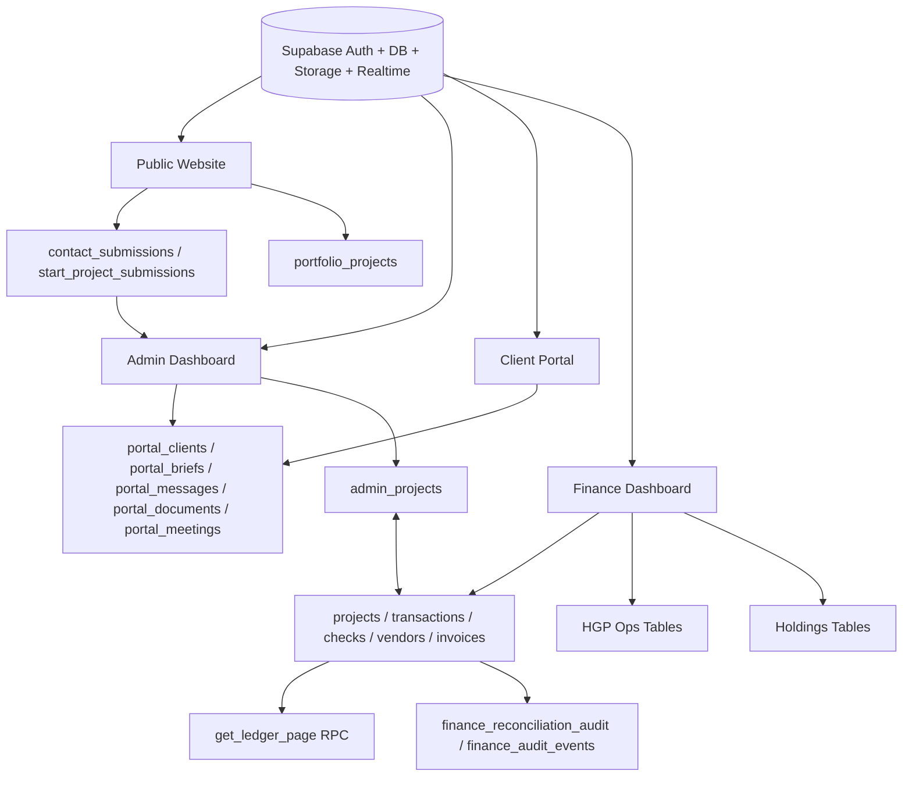
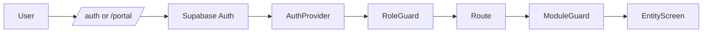
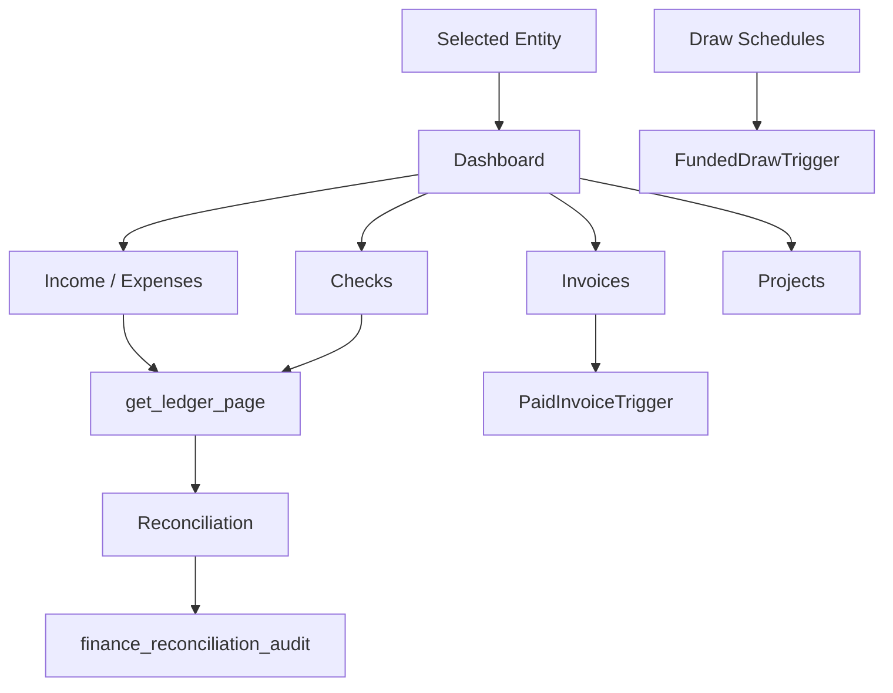
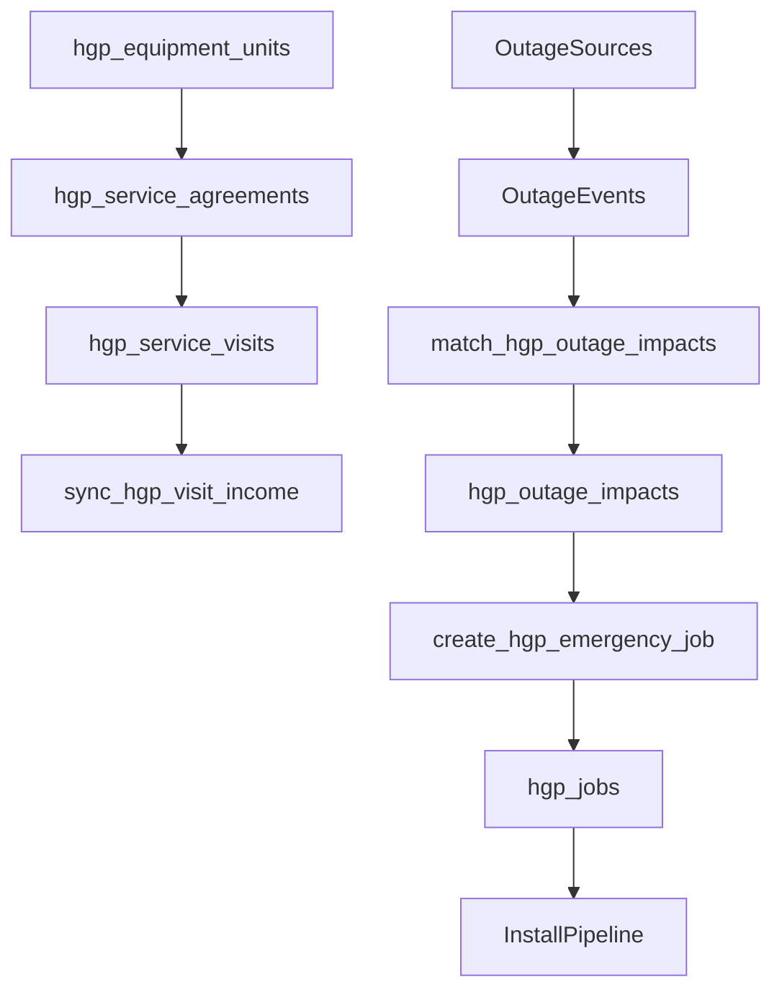
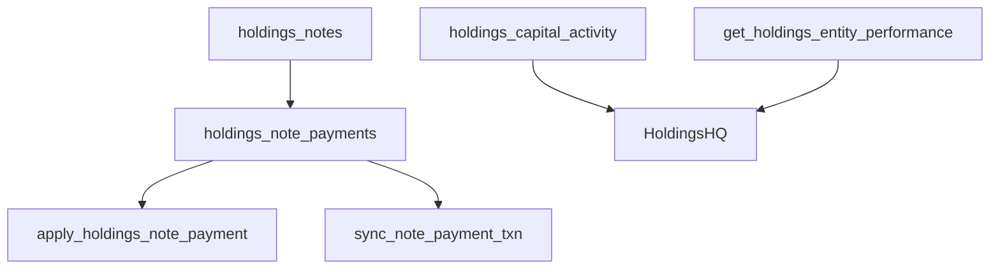
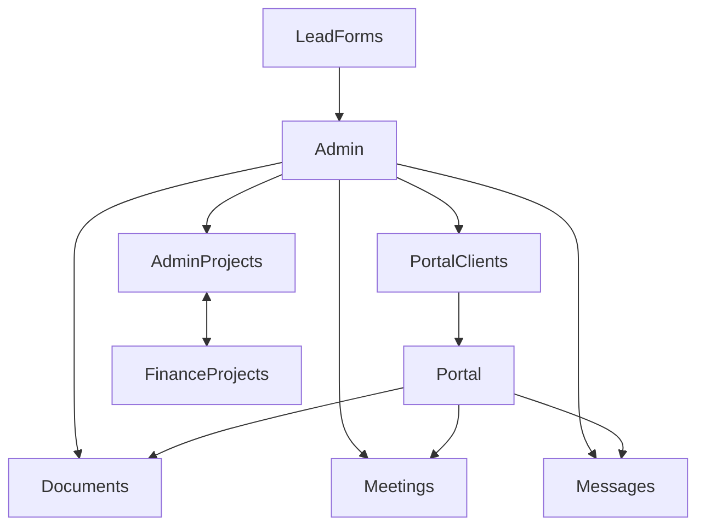

# HOU INC Financial Hub - Complete Engineering Specification

Generated by direct repository inspection on 2026-07-17 from `/Users/cardinal/Desktop/hou-inc-financial-hub`.

This document is written for a receiving engineering organization that has not previously seen the product. It documents the application as inspected locally: React routes, page/component/hook files, Supabase client usage, migrations, triggers, RPCs, policies, realtime channels, entity-specific workflows, test coverage, risks, and enterprise recommendations.

## Verification Boundary

Verified from source:

- `src/App.tsx` route tree.
- `src/pages`, `src/components`, `src/hooks`, `src/contexts`, `src/lib`, `src/integrations`.
- `supabase/migrations/*.sql`.
- `tests/launch/finance-launch.spec.ts`.
- `package.json` scripts and dependencies.
- Static build/test/lint gates from the current working copy.

Could not fully verify without direct database metadata access:

- Final live production row counts.
- Current Supabase auth users.
- Whether every historical migration has been applied to every environment beyond the verification rows the user previously reported.
- Runtime storage object inventory.
- Edge Function implementation for `stripe-payment-link`; the frontend invokes it, but the function source is not present in this repo snapshot.
- Live outage provider API availability; the current HGP outage system stores provider registry and manual/imported events, not a verified direct provider API connector.

## Current Validation Results

- `npm run lint:finance`: passed.
- `npm run test`: passed, 11/11 unit tests.
- `npm run build`: passed.
- `npm run test:launch`: passed, 16/16 Playwright launch tests after allowing Playwright to bind the local Vite server.

Known build warnings:

- Browserslist data is stale.
- The main production JavaScript bundle is large and should be code-split.

---

# Volume 1 - System Overview

## What This Application Is

The application is a multi-portal business operating system for HOU INC and related entities. It combines a public marketing website, client portal, admin operations dashboard, and entity-aware finance dashboard. The product is especially tailored for residential/commercial construction, generator installation/service, and holding-company finance.

## Why It Exists

The app exists to unify lead capture, client communication, project delivery, document management, finance operations, construction controls, entity-specific business operations, and executive oversight into a single system. The strongest business rationale is that construction and service companies often have fragmented workflows across website forms, spreadsheets, accounting tools, document drives, message threads, invoices, bank activity, and field operations. This app attempts to centralize those flows.

## Business Goals

- Convert public website leads into portal clients and projects.
- Allow clients to track projects, submit documents, view milestones, request support, and communicate.
- Allow admins to approve clients, manage client-level records, request documents, manage meetings, and oversee project delivery.
- Allow finance staff to manage entity-specific financial workflows across checks, income, expenses, ledger, invoices, vendors, charts, documents, controls, and operational specialty modules.
- Preserve entity context so Houston Enterprise, Houston Generator Pros, and Houston Enterprise Holdings do not share an identical generic finance experience.
- Provide launch-grade auditability through reconciliation logs, changelog entries, health events, and database triggers.

## Primary Users

- Public prospects visiting the construction website.
- Residential construction clients.
- Commercial construction clients.
- Generator installation/service customers.
- Portal clients using project/payment/document/message features.
- Admins managing client intake, projects, meetings, documents, and portfolio.
- Finance managers reconciling ledger activity and managing entity financials.
- Project managers tracking project execution, commitments, draw schedules, and change orders.
- Read-only auditors reviewing finance data and reconciliation history.
- Executive/owner stakeholders reviewing entity performance.

## Departments Represented

- Sales and lead intake.
- Client success / client portal operations.
- Construction project management.
- Finance/accounting.
- Vendor/subcontractor management.
- Document control.
- Executive management.
- Generator service operations.
- Holdings/debt/capital management.

## Core Workflows

1. Website visitor explores services and portfolio.
2. Prospect submits contact/start-project form.
3. Admin reviews submissions and approves/creates portal clients.
4. Client accesses portal and submits briefs, documents, meetings, messages, payments.
5. Admin manages client details, requested documents, messages, meetings, project assignments, milestones, and notes.
6. Finance creates/manages projects, vendors, checks, income, expenses, invoices, ledger entries, documents, and charts.
7. Construction projects use scope items, change orders, add-ons, milestones, draw schedules, retainage, WIP, commitments, and aging controls.
8. Funded draw requests automatically post income and are visible in ledger/control reporting.
9. Paid invoices and service/note workflows can post finance transactions through triggers.
10. Ledger reconciliation updates transactions/checks, writes audit records, and refreshes in realtime.
11. HGP manages generator equipment, service agreements, visits, install jobs, customer sites, outages, outage impacts, and emergency dispatch.
12. Holdings manages notes payable/receivable, note payments, capital contributions/distributions, tax reserves, management fees, and consolidated entity performance.

## High-Level Architecture

- Frontend: React + TypeScript + Vite.
- Routing: React Router DOM.
- Data fetching/cache: TanStack React Query.
- Database/Auth/Storage/Realtime: Supabase.
- UI primitives: Radix UI and local shadcn-style components.
- Charts: Recharts.
- PDF/Excel reporting: jsPDF, jspdf-autotable, ExcelJS.
- Maps: Mapbox GL.
- Animations: Framer Motion.
- Voice/assistant component: ElevenLabs React.
- Testing: Vitest and Playwright.

## Application Philosophy

The product is built as a business cockpit: operational screens are expected to show real data, support realtime updates, expose high-density decision information, and allow management actions from the dashboard rather than requiring users to bounce between disconnected tools.

---

# Volume 2 - Application Architecture

## Major Applications

### Public Website

Routes:

- `/`
- `/services`
- `/services/residential-construction`
- `/services/commercial-construction`
- `/services/project-management`
- `/services/:slug`
- `/portfolio`
- `/portfolio/:id`
- `/about`
- `/contact`
- `/start-project`

Primary purpose:

- Marketing presence for HOU INC.
- Service education.
- Portfolio display.
- Lead capture via contact/start project workflows.

Database communication:

- Public portfolio reads from `portfolio_projects`.
- Contact forms write to `contact_submissions`.
- Start project forms write to `start_project_submissions`.

### Client Portal

Routes:

- `/portal`
- `/portal/dashboard`
- `/portal/project`
- `/portal/messages`
- `/portal/documents`
- `/portal/meetings`
- `/portal/projects`
- `/portal/milestones`
- `/portal/payments`
- `/portal/settings`
- `/portal/gallery`
- `/portal/invite`

Primary purpose:

- Client login/invite/passwordless access.
- View project data.
- Manage messages, documents, meetings, milestones, payments, gallery, settings.

Database communication:

- `portal_clients`
- `portal_briefs`
- `portal_messages`
- `portal_documents`
- `portal_meetings`
- `project_milestones`
- `project_photos`
- `invoices`
- `change_orders`
- RPCs: `get_portal_client_by_email`, `get_portal_client_by_id`, `create_portal_client`, `verify_portal_password`, `set_portal_password`, `validate_portal_invite`, `consume_portal_invite`.

### Admin Dashboard

Route:

- `/admin`

Primary purpose:

- Admin-only operational command center.
- Portal client approval/rejection.
- Client detail workspaces.
- Document requests/review.
- Meeting management.
- Portal messages.
- Help requests.
- Admin changelog.
- Admin project management.
- Portfolio manager.
- Client map.
- Finance data panel.

Database communication:

- `portal_clients`
- `portal_briefs`
- `portal_messages`
- `portal_documents`
- `portal_meetings`
- `portal_help_requests`
- `contact_submissions`
- `start_project_submissions`
- `admin_changelog`
- `admin_projects`
- `portal_admin_notes`
- `portal_admin_log`
- `projects`
- `checks`
- `transactions`
- `vendors`
- `portfolio_projects`
- `map_pins`

Realtime:

- `admin-live` channel watches portal/admin tables.
- Several admin subcomponents have their own realtime subscriptions.

### Finance Dashboard

Routes:

- `/finance`
- `/finance/select`
- `/finance/dashboard`
- `/checks`
- `/checks/new`
- `/income`
- `/expenses`
- `/ledger`
- `/projects`
- `/projects/:id`
- `/vendors`
- `/concierge`
- `/charts`
- `/finance/controls`
- `/changelog`
- `/invoices`
- `/invoices/new`
- `/invoices/:id`
- `/settings`
- `/documents`
- `/storm`
- `/ops`

Primary purpose:

- Entity-aware financial operations.
- Entity selection.
- Ledger and reconciliation.
- Income/expense entry.
- Checks.
- Invoices.
- Vendors.
- Project finance.
- Construction controls.
- HGP generator operations and storm response.
- Holdings notes/capital management.

Entity architecture:

- The finance route group is wrapped in one `EntityProvider`.
- Entity state is stored in Supabase auth user metadata key `preferred_entity`.
- Entity profile behavior comes from `src/lib/entityFinance.ts`.

### Authentication

Implemented through:

- `AuthProvider` in `src/hooks/useAuth.tsx`.
- `RoleGuard` in `src/components/RoleGuard.tsx`.
- Supabase auth session and `app_user_roles`.
- Portal-specific auth/session utilities in `src/hooks/usePortal.ts`.

### Database

Supabase/Postgres stores operational, portal, admin, finance, HGP, and Holdings data. RLS is enabled on major tables. Many migrations include `SECURITY DEFINER` RPCs for controlled automation.

### Storage

Observed buckets:

- `documents`
- `portal-documents`

Storage usage:

- Document uploads in finance documents.
- Portal document uploads and requests.
- Project document bridging.

### Realtime

Realtime is implemented through Supabase `postgres_changes` channels:

- Finance realtime for transactions/checks/projects/vendors/invoices/audit/bank/commitments/health.
- Ledger reconciliation channel.
- Project breakdown channel.
- Admin live channel.
- Portal messages/gallery/milestones.
- Entity operations channel.
- Map pins channel.

### Messaging and Notifications

Messaging is database-backed:

- Portal messages use `portal_messages`.
- Admin sends messages to clients through the same table.
- Meeting creation also inserts message notifications.
- Toast notifications are in-app only through Sonner/toaster.
- External email/SMS delivery was not verified in source.

---

# Volume 3 - Route Inventory

## Master Route Table

| URL | Component | App Area | Auth | Permission | Entity Restriction | Database / Workflow |
|---|---|---:|---|---|---|---|
| `/` | `Home` | Public | No | Public | None | Marketing, service funnel |
| `/services` | `Services` | Public | No | Public | None | Service catalog |
| `/services/residential-construction` | `ResidentialConstruction` | Public | No | Public | None | Residential offer |
| `/services/commercial-construction` | `CommercialConstruction` | Public | No | Public | None | Commercial offer |
| `/services/project-management` | `ProjectManagementServices` | Public | No | Public | None | PM offer |
| `/services/:slug` | `ServiceDetail` | Public | No | Public | None | `servicesData` detail |
| `/portfolio` | `Portfolio` | Public | No | Public | None | Reads `portfolio_projects` |
| `/portfolio/:id` | `PortfolioDetail` | Public | No | Public | None | Portfolio detail |
| `/about` | `About` | Public | No | Public | None | Marketing |
| `/contact` | `Contact` | Public | No | Public | None | Writes `contact_submissions` |
| `/start-project` | `StartProject` | Public | No | Public | None | Writes `start_project_submissions` |
| `/portal` | `PortalAuth` | Portal | Portal/Supabase | Client | None | Client auth, invite/password flows |
| `/portal/dashboard` | `PortalDashboard` | Portal | Portal session | Client | Client scoped | `portal_*`, milestones |
| `/portal/project` | `PortalProject` | Portal | Portal session | Client | Client scoped | Project overview |
| `/portal/messages` | `PortalMessages` | Portal | Portal session | Client | Client scoped | `portal_messages`, realtime |
| `/portal/documents` | `PortalDocuments` | Portal | Portal session | Client | Client scoped | `portal_documents`, storage |
| `/portal/meetings` | `PortalMeetings` | Portal | Portal session | Client | Client scoped | `portal_meetings` |
| `/portal/projects` | `PortalProjects` | Portal | Portal session | Client | Client scoped | `portal_briefs`, projects |
| `/portal/milestones` | `PortalMilestones` | Portal | Portal session | Client | Client scoped | `project_milestones` |
| `/portal/payments` | `PortalPayments` | Portal | Portal session | Client | Client scoped | `invoices`, `change_orders` |
| `/portal/settings` | `PortalSettings` | Portal | Portal session | Client | Client scoped | client settings |
| `/portal/gallery` | `PortalGallery` | Portal | Portal session | Client | Client scoped | `project_photos`, realtime |
| `/portal/invite` | `PortalInvite` | Portal | Token/auth | Client | Invite scoped | invite RPCs |
| `/admin` | `Admin` | Admin | Supabase | `admin` | Houston Enterprise data focus in current code | Portal/admin/project/finance ops |
| `/auth` | `Auth` | Finance/Auth | No | login page | None | Supabase password auth |
| `/finance` | `EntitySelect` | Finance | Supabase | finance roles | Entity selector | user metadata |
| `/finance/select` | `EntitySelect` | Finance | Supabase | finance roles | Entity selector | user metadata |
| `/finance/dashboard` | `EntityOverview` | Finance | Supabase | finance roles | switches by entity | `Index`, `GeneratorOps`, `HoldingsHQ` |
| `/checks` | `Checks` | Finance | Supabase | finance roles | profile module | `checks`, `vendors`, `projects` |
| `/checks/new` | `CheckNew` | Finance | Supabase | finance roles | profile module | check creation |
| `/income` | `TxnPage kind=income` | Finance | Supabase | finance roles | entity category profile | `transactions` |
| `/expenses` | `TxnPage kind=expense` | Finance | Supabase | finance roles | entity category profile | `transactions`, allocations |
| `/ledger` | `Ledger` | Finance | Supabase | finance roles | entity ledger | `get_ledger_page`, transactions/checks |
| `/projects` | `EntityProjects` | Finance | Supabase | finance roles | HGP gets `HgpJobs`; others generic `Projects` | `projects` or `hgp_jobs` |
| `/projects/:id` | `ProjectDetail` | Finance | Supabase | finance roles | entity project | project finance/detail |
| `/vendors` | `Vendors` | Finance | Supabase | finance roles | label varies | `vendors` |
| `/concierge` | `Concierge` | Finance | Supabase | finance roles | `concierge` module only | concierge workspace |
| `/charts` | `Charts` | Finance | Supabase | finance roles | charts adapt by entity | finance analytics |
| `/finance/controls` | `FinanceControls` | Finance | Supabase | finance roles | `controls` module only | WIP/aging/commitments |
| `/changelog` | `Changelog` | Finance | Supabase | finance roles | shared | `admin_changelog` |
| `/invoices` | `Invoices` | Finance | Supabase | finance roles | shared | `invoices` |
| `/invoices/new` | `InvoiceNew` | Finance | Supabase | finance roles | shared | invoice create |
| `/invoices/:id` | `InvoiceNew` | Finance | Supabase | finance roles | shared | invoice edit |
| `/settings` | `Settings` | Finance | Supabase | finance roles | shared | Supabase auth settings |
| `/documents` | `Documents` | Finance | Supabase | finance roles | entity tags vary | `documents`, storage |
| `/storm` | `StormResponse` | Finance/HGP | Supabase | finance roles | HGP-only via ModuleGuard | outage/site/emergency workflows |
| `/ops` | `OpsCenter` | Finance/Admin | Supabase | `admin` | shared ops | system ops |
| `*` inside finance | `NotFound` | Finance | Supabase route shell | N/A | N/A | fallback |
| `/*` | `FinanceRoutes` | Root | nested | finance guard inside | shared `EntityProvider` | finance route group |

---

# Volume 4 - Screen Inventory

## Public Screens

### `Home`

Purpose: public homepage and brand entry. Uses website layout, service navigation, animated/visual marketing sections, and conversion links. Expected user is a public prospect. Current status: present and routed.

### `Services`

Purpose: service overview. Expected user is a prospect comparing construction services. Current status: present and routed.

### `ResidentialConstruction`, `CommercialConstruction`, `ProjectManagementServices`

Purpose: dedicated landing/service pages for primary construction service lines. Expected user is a residential/commercial client or owner representative. Current status: present and routed.

### `ServiceDetail`

Purpose: dynamic detail page for service slugs backed by local `servicesData`. Current status: routed through `/services/:slug`.

### `Portfolio` and `PortfolioDetail`

Purpose: public project portfolio and detail experience. Database: `portfolio_projects` through Supabase client in `Portfolio`. Current status: routed.

### `About`, `Contact`, `StartProject`

Purpose: company credibility, inbound communication, and lead/project submission. Database: `contact_submissions` and `start_project_submissions`. Current status: routed.

## Portal Screens

### `PortalAuth`

Purpose: client access, signup/login/invite/password. Actions: OTP auth, password RPCs, invite validation. Database/RPC: `portal_clients`, `get_portal_client_by_email`, `create_portal_client`, `verify_portal_password`, `set_portal_password`. Current status: routed.

### `PortalDashboard`

Purpose: client overview of project state, milestones, messages, documents, meetings, payments. Database: portal hook aggregate data. Current status: routed.

### `PortalProject`, `PortalProjects`

Purpose: client project and project brief management. Database: `portal_briefs`, linked project data. Current status: routed.

### `PortalMessages`

Purpose: client/admin messaging. Database: `portal_messages`. Realtime: `portal-msgs-{client.id}`. Current status: routed.

### `PortalDocuments`

Purpose: document submission/request workflow. Database: `portal_documents`; storage bucket `portal-documents`. Current status: routed.

### `PortalMeetings`

Purpose: meeting schedule visibility and management. Database: `portal_meetings`. Current status: routed.

### `PortalMilestones`

Purpose: client milestone tracking. Database: `project_milestones`. Current status: routed.

### `PortalPayments`

Purpose: invoice/change order/payment review. Database: `invoices`, `change_orders`. Current status: routed.

### `PortalGallery`

Purpose: project photo gallery. Database: `project_photos`. Realtime: `portal-gallery-{client.id}`. Current status: routed.

### `PortalSettings`, `PortalInvite`

Purpose: account settings and invite onboarding. Database/RPC: invite validation/consumption. Current status: routed.

## Admin Screens and Subscreens

### `Admin`

Purpose: single-page admin operating dashboard with internal tabbed/sectioned views. Auth: `RoleGuard allowed=['admin']`. Key areas observed:

- Overview KPIs and dashboard cards.
- Portal client list/detail.
- Portal briefs.
- Messages.
- Documents.
- Meetings.
- Help requests.
- Start-project/contact submission review.
- Admin project management.
- Portfolio management.
- Client map.
- Finance data panel.
- Admin changelog.
- Client notes/logging.

Database: broad direct Supabase access to portal, admin, finance, and public lead tables.

Current status: routed. Candid architecture note: this file is large (`2696` lines) and should eventually be split into route-level/detail-level components for maintainability.

## Finance Screens

### `EntitySelect`

Purpose: pick active finance entity. Writes preferred entity to Supabase auth metadata through `EntityProvider`. Current status: routed.

### `EntityOverview`

Purpose: entity-aware dashboard switch. Components:

- `Index` for Houston Enterprise.
- `GeneratorOps` for Houston Generator Pros.
- `HoldingsHQ` for Houston Enterprise Holdings.

### `Index`

Purpose: construction finance overview dashboard. Connects to finance data through hooks and chart components. Current status: entity dashboard for Houston Enterprise.

### `GeneratorOps`

Purpose: HGP generator-business command center. Features: equipment units, service agreements, service visits, KPI summaries, service/emergency revenue, ARR, warranty/service status, income posting via triggers. Database: `hgp_equipment_units`, `hgp_service_agreements`, `hgp_service_visits`, `transactions`, `get_hgp_finance_summary`. Current status: routed through `EntityOverview`.

### `HoldingsHQ`

Purpose: Holdings finance command center. Features: notes payable/receivable, capital activity, note payments, interest income/expense, consolidated entity totals. Database: `holdings_notes`, `holdings_capital_activity`, `holdings_note_payments`, `transactions`, `get_holdings_entity_performance`. Current status: routed through `EntityOverview`.

### `Checks`, `CheckNew`

Purpose: check register and check creation. Database: `checks`, `vendors`, `projects`. Related triggers: check ledger posting and reconciliation audit. Current status: routed.

### `TxnPage`

Purpose: income and expense entry. Entity category catalogs customize labels/options. Database: `transactions`, project scope items, milestones, change orders. Current status: routed as `/income` and `/expenses`.

### `Ledger`

Purpose: high-density ledger register and reconciliation center. Database: `get_ledger_page`, `transactions`, `checks`, reconciliation audit, changelog. Realtime: transaction/check changes refresh ledger. Current status: routed and Playwright-tested for compact reconciliation center/no mobile overflow.

### `Projects`

Purpose: Houston Enterprise and Holdings generic project/assets workspace. Database: `projects`, related finance. Current status: routed through `EntityProjects` for non-HGP.

### `HgpJobs`

Purpose: HGP-specific install/service job management. Features: generator install stages, service/maintenance/emergency/warranty/survey jobs, permit/inspection/equipment status, job economics, deposits/balances/margins, emergency filtering. Database: `hgp_jobs`, `hgp_equipment_units`, `vendors`. Current status: now routed for HGP `/projects`.

### `StormResponse`

Purpose: HGP outage intelligence and storm response. Features: outage source registry, outage event logging, customer site registry, outage impact matching, outreach status, emergency job dispatch. Database/RPC: `hgp_outage_sources`, `hgp_outage_events`, `hgp_outage_impacts`, `hgp_customer_sites`, `hgp_jobs`, `match_hgp_outage_impacts`, `create_hgp_emergency_job`. Current status: now routed at `/storm`, HGP-only.

### `ProjectDetail`

Purpose: detailed finance/project management view. Components include project breakdown, transactions, documents, milestone timeline, details cards, charts. Database: `projects`, `transactions`, `checks`, `invoices`, project breakdown tables. Current status: routed.

### `Vendors`

Purpose: vendor/supplier management. Entity label changes to Suppliers for HGP. Database: `vendors`. Current status: routed.

### `Concierge`

Purpose: construction concierge module. Entity restriction: module exists for Houston Enterprise, hidden/blocked for HGP/Holdings. Current status: routed with `ModuleGuard`.

### `Charts`

Purpose: finance analytics and entity insight charts. Components: `EntityInsightCharts`, chart panels. Current status: routed.

### `FinanceControls`

Purpose: construction finance controls: WIP, aging, change order exposure, commitments. Entity restriction: controls module. Database/RPC: `get_finance_control_summary`, `get_finance_aging_summary`, `finance_commitments`. Current status: routed with `ModuleGuard`.

### `Changelog`

Purpose: finance/admin changelog browser. Database: `admin_changelog`. Current status: routed.

### `Invoices`, `InvoiceNew`

Purpose: invoice list/create/edit. Database: `invoices`, `portal_clients`; Edge Function `stripe-payment-link` invoked for payment links. Current status: routed.

### `Settings`

Purpose: user settings, password/email metadata updates. Database/Auth: Supabase auth. Current status: routed.

### `Documents`

Purpose: finance document center with upload/drag/camera flows, entity-specific tags. Database/storage: `documents` and bucket `documents`. Current status: routed.

### `OpsCenter`

Purpose: admin-only operations center. Auth: admin role. Current status: routed.

### `Auth`, `NotFound`, `Glossary`, `WebScraper`

`Auth` is routed. `NotFound` is used as fallback. `Glossary` and `WebScraper` exist as page files but were not found in the active `App.tsx` route inventory.

---

# Volume 5 - Component Inventory

## Statistics

- Component files under `src/components`: 107.
- Page files under `src/pages`: 51.
- UI primitive files under `src/components/ui`: included in the 107 component count.
- Admin-specific component files: 12.
- Project-detail component files: 15.
- Motion component files: 5.
- Chart-specific component files: 1 plus shared chart panels.

## Shared Application Components

| Component | Purpose | Reusable | Database Usage |
|---|---|---:|---|
| `AppShell` | Finance dashboard shell, nav, entity selector, mobile menu, add-entry sheet | Yes | indirect via entity/auth |
| `PublicLayout` | Public website layout/nav/footer/mega menu | Yes | No direct |
| `PortalLayout` | Portal shell/navigation | Yes | indirect via portal hook |
| `PageHeader` | Shared dashboard page heading | Yes | No |
| `RoleGuard` | Role-based route protection | Yes | uses `useAuth` |
| `Protected` | Auth wrapper | Yes | uses `useAuth` |
| `ActionToolbar` | dashboard command toolbar | Yes | No |
| `DigitalCheck` | visual check preview | Yes | No |
| `ElevenLabsAgent` | voice/agent UI on selected routes | Yes | env-driven |
| `FinanceDetailDrawer` | details drawer for check/income/expense/vendor/ledger/document records | Yes | data passed in |
| `FinanceProjectWizard` | finance/admin project creation wizard | Yes | `admin_projects`, `projects`, auth |
| `FinancialChartPanel` | finance chart visualizations | Yes | data passed in |
| `SmartWidget` | dashboard utility widget | Yes | No direct |
| `SparklineChart`, `StatChartPanel` | chart primitives | Yes | data passed in |
| `TimeFilter` | date period filter | Yes | No |
| `QuickCreateSelect` | quick create/select UI | Yes | data passed in |
| `ProjectBreakdown` | complex project scope/change/draw/reconciliation workspace | Domain reusable | many project finance tables |

## Admin Components

| Component | Purpose | Database Usage |
|---|---|---|
| `ClientMap` | admin map and pin manager | `map_pins`, Mapbox |
| `DocumentsManager` | admin document management | `portal_documents`, storage |
| `FinanceDataPanel` | admin finance snapshot panel | finance tables |
| `MilestoneManager` | admin milestone editor/reorder | `project_milestones`, realtime |
| `PortfolioManager` | admin portfolio management | `portfolio_projects` |
| `ProjectManager` | admin project manager and admin/finance project integration | `admin_projects`, related project tables |
| `ActionButton` | admin design button | No |
| `AdminSidebar` | admin navigation | No |
| `AdminTable` | admin table primitive | No |
| `OverviewDashboard` | admin overview design | data passed |
| `StatusBadge` | admin status label | No |
| `VerticalTimeline` | admin timeline display | No |

## Project Detail Components

| Component | Purpose |
|---|---|
| `ActivityFeedCard` | project activity feed display |
| `DocumentsCard` | project documents card |
| `DonutChart` | project donut chart |
| `FlushTabs` | dense tab strip |
| `MilestoneTimeline` | visual milestone timeline |
| `MiniTable` | compact table primitive |
| `ProgressRing` | circular progress display |
| `ProjectDetailsCard` | project info card |
| `ProjectGantt` | project timeline/gantt |
| `ProjectTransactionLedger` | project transaction ledger |
| `Sparkline` | project sparkline |
| `StatCard` | project KPI card |
| `TrendLineChart` | project trend chart |
| `cardStyles` | shared project card styles |
| `formPrimitives` | project form primitives |

## Chart Components

- `EntityInsightCharts`: switches analytics by entity. HGP focuses generator revenue/equipment/service mix; Holdings focuses entity performance/capital/notes; construction uses shared finance visuals.

## Motion Components

- `AnimatedCounter`
- `MagneticButton`
- `Marquee`
- `Reveal`
- `TiltCard`

## UI Primitive Components

Radix/shadcn-style primitives exist for accordion, alert dialog, avatar, badge, breadcrumb, button, calendar, card, carousel, chart, checkbox, command, context menu, currency/date inputs, dialog, drawer, dropdown, form, hover card, input OTP, input, label, menu/navigation, pagination, popover, progress, radio group, resizable panels, scroll area, select, separator, sheet, sidebar, skeleton, slider, smart email/location/phone inputs, sonner/toast, switch, table, tabs, textarea, toggle group, tooltip.

Current complexity:

- Most UI primitives are standard and reusable.
- `Admin`, `ProjectBreakdown`, `AppShell`, `FinanceProjectWizard`, `Ledger`, `TxnPage`, and `Checks` are high-complexity modules and are candidates for decomposition after launch.

---

# Volume 6 - Hooks

## `useAuth`

Purpose: global Supabase auth/session and role context. Inputs: none. Outputs: user, role, loading, signIn, signOut. Database: Supabase auth plus `app_user_roles`. React Query: no. Critical for `RoleGuard`.

## `useEntity`

Defined in `EntityContext.tsx`. Purpose: selected business entity. Inputs: provider children. Outputs: selected entity, entity list, setter, readiness. Database/Auth: Supabase auth metadata `preferred_entity`.

## `useTheme`

Purpose: theme selection and document class management. Outputs theme and setter. Storage: local state/class usage.

## `useFinance`

Purpose: finance data layer. Hooks include:

- `useFinanceBankAccounts`
- `useFinanceCostCodes`
- `useFinanceDivisions`
- `useFinanceProjectPhases`
- `useCreateTransactionAllocations`
- `useVendors`
- `useFinanceRealtime`
- `useLedgerPage`
- `useFinanceControlSummary`
- `useFinanceAgingSummary`
- `useFinanceCommitments`
- `useBankMatchSuggestions`
- `useProjects`
- `useChecks`
- `useTransactions`
- `useUpsert`
- `useDelete`
- `useQuickCreate`

Database: checks, projects, vendors, transactions, invoices, finance bank/accounts/cost/division/phase/commitment/suggestion tables, RPCs.

## `useConstructionFinance`

Purpose: construction project financial controls. Hooks:

- ensure accounting config.
- get project financial summary.
- transaction allocations.
- post transaction/check to ledger.

Database/RPC: `ensure_default_accounting_config`, `get_project_financial_summary`, `finance_transaction_allocations`, `post_transaction_to_ledger`, `post_check_to_ledger`. Realtime: project finance channel.

## `useEntityOps`

Purpose: HGP and Holdings operational data. Hooks:

- HGP: equipment units, service agreements, service visits, jobs, customer sites, outage sources/events/impacts, HGP finance summary.
- Holdings: notes, capital activity, note payments, consolidated totals.
- Mutations: entity ops upsert and soft delete.
- Realtime: invalidates entity operation tables.

Database/RPC: HGP/Holdings tables, `get_hgp_finance_summary`, `get_holdings_entity_performance`.

## `useDocuments`

Purpose: finance document storage and database metadata. Database/storage: `documents`, bucket `documents`, signed URLs, delete/update/upload.

## `useInvoices`

Purpose: invoice list, totals, mutations. Database: `invoices`. Utility functions calculate line item totals, subtotal, tax, total, and next invoice number.

## `usePortal`

Purpose: portal session, client data, messages, briefs, documents, meetings, client auth helpers. Database/RPC: portal tables and portal RPCs.

## `usePortalClients`

Purpose: admin/client portal client list and creation. Database: `portal_clients`.

## `useFinanceChangelog`

Purpose: insert changelog entries. Database: `admin_changelog`.

## `useIntegrations`

Purpose: local integration settings. Storage: localStorage key `hou-integrations`.

## `useSound`

Purpose: UI audio feedback hook. No database.

## `use-mobile`

Purpose: responsive breakpoint hook. No database.

## `use-toast`

Purpose: local toast state/reducer utility.

---

# Volume 7 - Contexts & Providers

## Provider Tree

`App` wraps:

1. `QueryClientProvider`
2. `ConversationProvider`
3. `TooltipProvider`
4. Toast providers
5. `BrowserRouter`
6. `ThemeProvider`
7. `AuthProvider`
8. `ScrollToTop`
9. `GlobalShortcuts`
10. Route tree

## `AuthProvider`

Responsible for Supabase session retrieval, auth state subscription, user mapping, role lookup from `app_user_roles`, sign-in, and sign-out.

## `EntityProvider`

Finance routes are wrapped in a single `EntityProvider`. It loads the preferred entity from Supabase auth metadata and updates metadata when changed. This prevents stale entity state across finance routes.

## `ThemeProvider`

Controls visual theme class names. Uses theme constants and exposes `useTheme`.

## `QueryClientProvider`

Central React Query client. Query/mutation errors call `recordSystemHealthEvent`; schema cache errors are marked more severe. This is a notable enterprise hardening feature.

## `ConversationProvider`

Required by `@elevenlabs/react` for `ElevenLabsAgent`.

---

# Volume 8 - Database Architecture

## Migration Inventory

Detected SQL migration files: 55.

Major migration eras:

- 202605 base finance schema: vendors, projects, checks, transactions, enums, RLS.
- 202606 contact submissions.
- 20260711 cross-platform bridge: portal password resets, project photos, milestones, change orders, admin notes/log.
- 20260712 start-project and portal document/milestone repairs.
- 20260713 portal password RPC, project document bridge, map pins.
- 20260714 admin project management, project sync, changelog, project breakdown, SOV-income link.
- 20260715 construction finance upgrade, finance audit triggers, expense entry, invoice portal bridge.
- 20260716 admin/finance project link, funded draw income sync, launch hardening, finance controls, entity operations.
- 20260717 entity summaries, ledger context, HGP field operations.

## Tables

Unique tables detected from migrations:

- `admin_changelog`
- `admin_project_milestones`
- `admin_project_updates`
- `admin_projects`
- `app_user_roles`
- `change_orders`
- `checks`
- `company_accounting_settings`
- `contact_submissions`
- `documents`
- `draw_schedules`
- `finance_attachments`
- `finance_audit_events`
- `finance_bank_accounts`
- `finance_bank_activity`
- `finance_bank_imports`
- `finance_bank_match_suggestions`
- `finance_categories`
- `finance_chart_accounts`
- `finance_check_allocations`
- `finance_commitments`
- `finance_construction_divisions`
- `finance_cost_codes`
- `finance_journal_entries`
- `finance_journal_lines`
- `finance_project_phases`
- `finance_reconciliation_audit`
- `finance_transaction_allocations`
- `hgp_customer_sites`
- `hgp_equipment_units`
- `hgp_jobs`
- `hgp_outage_events`
- `hgp_outage_impacts`
- `hgp_outage_sources`
- `hgp_service_agreements`
- `hgp_service_visits`
- `holdings_capital_activity`
- `holdings_note_payments`
- `holdings_notes`
- `invoices`
- `portal_admin_log`
- `portal_admin_notes`
- `portal_help_requests`
- `portal_invites`
- `portal_password_resets`
- `project_add_ons`
- `project_change_orders`
- `project_milestone_sov_links`
- `project_milestones`
- `project_photos`
- `project_scope_items`
- `projects`
- `start_project_submissions`
- `system_health_events`
- `transactions`
- `vendors`

Extractor note: one dynamic PL/pgSQL construct produced `IF` in the raw extraction. This is not a real table and is excluded from the architecture list.

## Enums

- `check_status`: `pending`, `cleared`, `voided`.
- `txn_type`: `income`, `expense`.
- `project_status`: `active`, `on_hold`, `completed`, `archived`.

## Views

- `finance_project_control_summary`: construction finance rollup view for budget, approved/pending/rejected change orders, revised contract value, earned revenue, actual cost, commitments, AR/AP, retainage, WIP percent complete, over/under billing, margin.

## SQL Functions / RPCs

Detected functions:

- `accept_bank_match_suggestion`
- `apply_holdings_note_payment`
- `audit_reconciliation_change`
- `can_manage_entity_roles`
- `consume_portal_invite`
- `create_hgp_emergency_job`
- `ensure_default_accounting_config`
- `finance_allocation_guard`
- `finance_changelog_entity`
- `finance_changelog_label`
- `finance_invoice_total`
- `finance_next_number`
- `generate_bank_match_suggestions`
- `get_finance_aging_summary`
- `get_finance_control_summary`
- `get_hgp_finance_summary`
- `get_holdings_entity_performance`
- `get_ledger_page`
- `get_portal_client_by_email`
- `get_portal_project_data`
- `get_project_financial_summary`
- `invoice_total_amount`
- `log_finance_record_change`
- `log_portal_changelog`
- `map_admin_status_to_finance`
- `match_hgp_outage_impacts`
- `post_check_to_ledger`
- `post_transaction_to_ledger`
- `resolve_portal_help_request`
- `reverse_journal_entry`
- `set_updated_at`
- `submit_portal_help_request`
- `sync_admin_project_delete`
- `sync_admin_project_status_update`
- `sync_admin_project_to_finance`
- `sync_admin_project_update`
- `sync_finance_project_to_admin`
- `sync_finance_project_update`
- `sync_funded_draw_to_income`
- `sync_hgp_visit_income`
- `sync_note_payment_txn`
- `sync_paid_invoice_to_income`
- `user_has_entity_role`
- `validate_portal_invite`
- `verify_entity_finance_summaries`
- `verify_entity_operations_depth`
- `verify_finance_launch_migrations`
- `verify_hgp_field_ops`
- `verify_ledger_entity_context`

## Triggers

Detected trigger names include:

- update timestamp triggers: vendors, projects, checks, transactions, invoices, admin projects, documents, project breakdown tables, dynamic entity-operation tables.
- admin/finance sync: `trg_sync_finance_project_to_admin`, `trg_sync_admin_project_to_finance`, `trg_sync_admin_project_update`, `trg_sync_finance_project_update`, `trg_sync_admin_project_delete`.
- funded draw sync: `trg_sync_funded_draw_to_income`, `trg_void_funded_draw_income`.
- invoice sync: `trg_sync_paid_invoice_to_income`.
- HGP sync: `trg_sync_hgp_visit_income`, `trg_void_hgp_visit_income`.
- Holdings sync: `trg_apply_holdings_note_payment`, `trg_sync_note_payment_txn`, `trg_void_note_payment_txn`.
- reconciliation audit: `trg_audit_transaction_reconciliation`, `trg_audit_check_reconciliation`.
- finance allocation guard: `trg_finance_allocation_guard`.

## RLS Policies

Detected policy families:

- Owner policies for base finance tables.
- Portal public insert/select/update/delete policies where applicable.
- Admin auth-only policies.
- Portal invite policies.
- Document and storage object policies.
- Entity role policies in `app_user_roles`.
- Finance audit, bank activity, bank imports, match suggestions, commitments.
- HGP owner policies.
- Holdings owner policies.
- System health insert/admin select policies.

## Storage Buckets

- `portal-documents`: inserted/managed in admin document migration.
- `documents`: used by `useDocuments`; bucket creation was not fully verified in migration extraction.

## Database Statistics

- Tables detected: 54 real tables plus dynamic migration constructs.
- SQL functions/RPCs detected: 49.
- Named trigger patterns detected: 31 plus dynamic table-specific generated triggers.
- Policies detected: 80+ unique names.
- Views detected: 1.
- Enums detected: 3.
- Migrations detected: 55.

---

# Volume 9 - Entity Architecture

## Houston Enterprise

Purpose: residential/commercial construction company. Finance dashboard remains construction-oriented.

Modules:

- overview
- ledger
- checks
- income
- expenses
- projects
- vendors
- invoices
- charts
- controls
- changelog
- concierge
- documents

Workflows:

- Construction project creation.
- Project budgets, change orders, SOV, add-ons, milestones.
- Draw schedule and funded draw income.
- Invoice and payment tracking.
- Retainage, WIP, commitments, aging.
- Vendor/check/expense management.
- Admin project sync with `admin_projects`.

Shared data:

- `projects`, `transactions`, `checks`, `vendors`, `invoices`.
- Portal and admin project relationships.

## Houston Generator Pros

Purpose: generator installation and service company providing backup power solutions.

Modules:

- Generator Ops overview.
- ledger
- checks
- income
- expenses
- Install Jobs via `/projects`
- Suppliers via `/vendors`
- invoices
- charts
- changelog
- documents
- Storm Response via `/storm`

Special data:

- `hgp_equipment_units`
- `hgp_service_agreements`
- `hgp_service_visits`
- `hgp_jobs`
- `hgp_customer_sites`
- `hgp_outage_sources`
- `hgp_outage_events`
- `hgp_outage_impacts`

Special workflows:

- generator equipment inventory.
- service agreements.
- emergency and maintenance visits.
- visit revenue posting.
- install job stage pipeline.
- outage event logging and customer impact matching.
- one-click emergency job creation from outage impacts.

Terminology:

- Projects become Install Jobs.
- Vendors become Suppliers.
- Categories include generator sales, deposits, installation payments, maintenance plans, emergency service, warranty reimbursement, equipment purchases, distributor invoices, electrical labor, permits, warranty parts.

## Houston Enterprise Holdings

Purpose: holding company managing capital, loans, intercompany performance, distributions, and entity-level financial oversight.

Modules:

- Holdings HQ overview.
- ledger
- checks
- income
- expenses
- Assets & Deals via `/projects`
- vendors
- invoices
- charts
- changelog
- documents

Special data:

- `holdings_notes`
- `holdings_note_payments`
- `holdings_capital_activity`
- consolidated totals from finance tables.

Special workflows:

- notes payable/receivable.
- note payments.
- automatic principal/interest movement.
- interest income/expense transaction posting.
- capital contribution/distribution logging.
- tax reserve and management fee categories.

---

# Volume 10 - Feature Inventory

Feature count estimate from inspected pages/components/hooks/migrations: 180+ discrete features.

## Website Features

- Home page.
- Service overview.
- Residential construction service page.
- Commercial construction service page.
- Project management service page.
- Dynamic service detail.
- Public portfolio.
- Portfolio detail.
- About.
- Contact form.
- Start project form.
- Website layout/nav/footer/mega menu.

## Admin Features

- Admin auth gate.
- Admin overview.
- Portal client list.
- Client approval/rejection.
- Client detail view.
- Admin notes.
- Admin logs.
- Portal brief review.
- Message sending.
- Document request/review.
- Common document request catalog.
- Meeting creation/update/completion.
- Help request resolution.
- Contact/start-project submission review.
- Project management.
- Admin/finance project linking.
- Portfolio management.
- Client map/pins.
- Finance snapshot panel.
- Changelog.

## Finance Features

- Entity selection.
- Entity-specific dashboard.
- Checks.
- New check creation.
- Income entry.
- Expense entry.
- Ledger register.
- Reconciliation center.
- Reconcile/reopen actions.
- Reconciliation audit history.
- Server-side ledger pagination RPC.
- Finance realtime.
- Vendors/suppliers.
- Projects/assets/install jobs.
- Project detail.
- Project scope/SOV.
- Change orders.
- Add-ons.
- Milestones.
- Draw schedules.
- Funded draw income sync.
- Invoices.
- Payment link invocation.
- Documents.
- Charts.
- WIP controls.
- Retainage.
- AR/AP aging.
- Commitments.
- Bank import/match suggestion foundation.
- Health event logging.

## Portal Features

- Client registration/auth.
- Invite validation.
- Password RPC.
- Dashboard.
- Project overview.
- Messages with realtime.
- Document submission.
- Meeting visibility.
- Milestones.
- Payments.
- Gallery.
- Settings.

## HGP Features

- Equipment units.
- Service agreements.
- Service visits.
- Service visit income posting.
- Install jobs.
- Job pipeline.
- Permit/inspection/equipment statuses.
- Job margins and balances.
- Customer sites.
- Outage sources.
- Outage events.
- Outage impacts.
- Emergency dispatch.
- Storm response dashboard.

## Holdings Features

- Notes payable/receivable.
- Note payments.
- Automatic note balance updates.
- Interest posting.
- Capital activity.
- Contributions/distributions.
- Consolidated entity performance.

---

# Volume 11 - Workflow Inventory

## Lead to Client to Project

1. Prospect submits `/contact` or `/start-project`.
2. Records land in `contact_submissions` or `start_project_submissions`.
3. Admin reviews in `/admin`.
4. Admin approves/creates portal client in `portal_clients`.
5. Client receives/authenticates through portal/invite flow.
6. Portal brief/project records connect to admin and finance project records.
7. Finance/admin project sync keeps `admin_projects` and `projects` connected for Houston Enterprise.

## Client Document Workflow

1. Admin requests document from client.
2. `portal_documents` row is inserted.
3. Client uploads file to `portal-documents`.
4. Admin reviews and marks status/review metadata.
5. Portal/admin views refresh from Supabase.

## Meeting Workflow

1. Admin creates meeting with date/time/method/details.
2. `portal_meetings` row is inserted.
3. Optional message notification is inserted into `portal_messages`.
4. Admin/client can track status.

## Finance Workflow

1. User selects entity.
2. User creates projects/vendors/checks/transactions/invoices/documents.
3. React Query caches and realtime subscriptions keep screens fresh.
4. Ledger pulls server-side data through `get_ledger_page`.
5. Reconciliation actions update source rows and audit tables.
6. Reports/charts use hooks, RPCs, and local aggregations.

## Construction Controls Workflow

1. Project created.
2. Scope/SOV items are entered.
3. Change orders/add-ons/milestones/draw schedules are created.
4. Funded draws post income.
5. WIP/retainage/aging/commitment summaries roll up through views/RPCs.

## HGP Outage Workflow

1. Outage source exists or event is manually/imported.
2. Outage event is created with area fields.
3. `match_hgp_outage_impacts` matches customer sites by ZIP/county/city/provider.
4. Admin updates outreach status.
5. `create_hgp_emergency_job` creates emergency install/service job in `hgp_jobs`.

## Holdings Note Workflow

1. Note is created in `holdings_notes`.
2. Payment is created in `holdings_note_payments`.
3. Trigger applies principal/interest movement.
4. Trigger posts interest transaction.
5. Ledger context labels expose note-payment meaning.

---

# Volume 12 - Security

## Authentication

Supabase auth provides the main authenticated finance/admin session. Portal flows use Supabase auth plus portal-specific client lookups and local session helpers.

## Authorization

Frontend:

- `RoleGuard` restricts admin and finance routes.
- `ModuleGuard` restricts entity-specific modules.

Backend:

- RLS policies on finance, portal, admin, HGP, Holdings, documents, health, audit, and role tables.
- Role overrides in `app_user_roles`.
- Helper functions: `user_has_entity_role`, `can_manage_entity_roles`.

## Session Management

- `AuthProvider` tracks Supabase session.
- `EntityProvider` stores preferred entity in auth metadata.
- Portal session uses `hou-portal-session` storage key in `usePortal`.

## Audit Logs

- `finance_reconciliation_audit`.
- `finance_audit_events`.
- `admin_changelog`.
- `portal_admin_log`.
- `system_health_events`.

## Security Risks / Follow-Ups

- Several frontend files still use `(supabase as any)` because generated Supabase types lag migrations. Regenerate types and remove casts.
- Validate RLS semantics for client portal and admin tables under real roles, especially where policies use broad authenticated access.
- Verify Edge Function auth and webhook security for `stripe-payment-link`.
- Add CI gate for Playwright auth/role/overflow tests.
- Add security headers and production CSP at hosting layer.

---

# Volume 13 - Automations

## Database Trigger Automations

- Admin project insert/update/delete syncs to finance projects.
- Finance project insert/update syncs to admin projects.
- Funded draw status posts/voids income transaction.
- Paid invoice posts income transaction.
- HGP service visit posts/voids income transaction.
- Holdings note payment applies note balance and posts/voids transaction.
- Transaction/check reconciliation changes write audit rows.
- Finance allocation guard enforces ledger/accounting rules.
- Timestamp triggers maintain `updated_at`.

## RPC Automations

- Ledger paging.
- Finance controls.
- Finance aging.
- Bank match suggestion generation.
- Bank match acceptance.
- HGP outage impact matching.
- HGP emergency job creation.
- Portal password/invite/client functions.
- Construction accounting setup and project financial summary.

## Realtime Automations

- Finance invalidation channel.
- Ledger reconciliation refresh.
- Project breakdown refresh.
- Admin live refresh.
- Entity operations refresh.
- Portal messaging/gallery/milestone refresh.
- Map pin refresh.

## Health Monitoring

- Query/mutation errors call `recordSystemHealthEvent`.
- Schema cache mismatch detection exists through `isSchemaCacheError`.

---

# Volume 14 - Reporting

## Dashboards

- Construction overview (`Index`).
- HGP overview (`GeneratorOps`).
- Holdings overview (`HoldingsHQ`).
- Admin overview.
- Portal dashboard.

## Reports / Exports

`src/lib/reports.ts` includes:

- transaction PDF report.
- check register PDF report.
- ledger PDF report.
- ledger record PDF report.
- project report.
- project reconciliation report.
- invoice report.
- glossary PDF.
- Excel exports for transactions, checks, ledger, projects, invoices.
- CSV download helper.

## Analytics

- Finance chart panels.
- Entity insight charts.
- Cash flow, exposure, inflow/outflow, pending aging.
- HGP entity summary RPC.
- Holdings entity performance RPC.
- Finance control summary view/RPC.

---

# Volume 15 - Technical Metrics

Measured locally:

- Total lines inspected by `wc`: approximately 80,339 across selected source, migration, and test globs.
- Page files: 51.
- Component files: 107.
- Hook files: 14.
- Context files: 1.
- Active route entries in `App.tsx`: 49.
- Migration files: 55.
- Real tables detected: approximately 54.
- SQL functions/RPCs detected: 49.
- Trigger names detected: 31 plus dynamic migration-created triggers.
- Policies detected: 80+.
- Views detected: 1.
- Enums detected: 3.

Estimated complexity:

- Project complexity: high.
- Business-domain complexity: high.
- Database automation complexity: high.
- UI complexity: high.
- Current maintainability risk: medium-high due to several very large files and generated types drift.
- Estimated historical development effort represented by repository: 1,000-2,500 engineering hours depending on team seniority and design iteration history.

---

# Volume 16 - Architecture Diagrams

## System Architecture

## Authentication Flow

## Finance Workflow

## HGP Workflow

## Holdings Workflow

## Admin/Portal Workflow

---

# Volume 17 - Code Quality Review

## Strengths

- Strong domain coverage for construction finance, portal operations, generator service, and holdings finance.
- Good use of Supabase RLS and trigger/RPC automation.
- Entity-aware profiles are centralized in `entityFinance`.
- React Query is used broadly and paired with realtime invalidation.
- Launch tests cover auth redirects, mobile overflow, entity switching, trigger-created transactions, ledger context, funded draw, and reconciliation audit.
- Database verification helper RPCs exist.

## Maintainability Risks

- Several large files should be decomposed:
  - `Admin.tsx`
  - `ProjectBreakdown.tsx`
  - `Ledger.tsx`
  - `TxnPage.tsx`
  - `Checks.tsx`
  - `AppShell.tsx`
  - `FinanceProjectWizard.tsx`
- Generated Supabase types are behind the migration layer; casts remain.
- Some routeable page files exist but are not routed (`Glossary`, `WebScraper`).
- Large bundle should be code-split by app area and heavy libraries.

## Scalability

Good:

- `get_ledger_page` supports server-side paging/filtering.
- Entity rollup RPCs reduce full-table client scans.
- Realtime invalidation is targeted by entity/table.

Needs improvement:

- Admin dashboard still performs broad client-side loads across several tables.
- Portal/admin client lists need server-side pagination for thousands of clients.
- Documents and portfolio management should paginate/search server-side.

## Performance

- Build succeeds but main bundle is approximately 7.3 MB before gzip.
- Heavy libraries include Recharts, jsPDF, ExcelJS, Mapbox, Three, ElevenLabs, Framer Motion.
- Recommendation: lazy-load finance/admin/portal/public app bundles separately, and lazy-load report/export/map/voice/chart modules.

## Security

Good:

- Supabase auth.
- RLS.
- role overrides.
- audit tables.

Needs verification:

- Production RLS under all roles.
- Storage bucket policies.
- Edge Function security.
- Role-management UI and workflows.
- Audit export/access controls.

---

# Volume 18 - Enterprise Audit

Scores based on inspected source, not live production operations.

| Category | Score | Rationale |
|---|---:|---|
| Architecture | 8 | Strong modular business architecture, but several files are oversized. |
| Scalability | 7 | Good RPC movement for ledger/entity summaries; admin/portal tables need paging. |
| Security | 7 | RLS and guards exist; needs full role/RLS test matrix and type cleanup. |
| Compliance/Auditability | 8 | Reconciliation audit, changelog, health events, finance audit triggers. |
| Finance Domain Fit | 8 | Construction controls, retainage, WIP, aging, commitments, entity-specific finance. |
| Construction Operations Fit | 8 | Project breakdown, SOV, change orders, draw schedules, milestones, portal. |
| HGP Fit | 8 | HGP-specific ops, jobs, service visits, outage response foundation. |
| Holdings Fit | 7 | Notes/capital/consolidation exist; asset/deal lifecycle can go deeper. |
| Data Model | 8 | Broad relational model with FKs/indexes; needs live schema/type verification. |
| Automation | 8 | Strong trigger/RPC automation; needs monitoring dashboards and retry/queue systems. |
| Maintainability | 6 | Functionality is broad; large files and casts are the main issue. |
| Technical Risk | 7 | Tests are green, but bundle size/type drift/admin scaling are risks. |
| Business Risk | 7 | Strong launch base; confirm financial controls with CPA before real books. |
| Vendor Risk | 6 | Supabase central dependency; outage provider APIs and Stripe function need verification. |

---

# Volume 19 - Missing Enterprise Features

## Highest Priority

1. CI/CD launch pipeline: run lint, tests, build, Playwright, migration verification on every deploy. Complexity: medium.
2. Supabase type regeneration and strict table/RPC typing. Complexity: low-medium.
3. Admin and portal server-side pagination/search. Complexity: medium.
4. Role management UI for app roles and entity access. Complexity: medium.
5. Financial close period locking. Complexity: medium-high.
6. Bank import UI and accepted-match workflow completion. Complexity: medium-high.
7. Audit export center for reconciliation/changelog/finance audit events. Complexity: medium.
8. Production observability dashboard for `system_health_events`. Complexity: medium.

## Finance/Accounting Additions

- Payroll/job labor costing.
- Time tracking.
- Budget versus actual by cost code.
- Vendor bill approval workflow.
- Purchase orders/subcontracts UI beyond commitments table.
- Retainage release workflow.
- Lien waiver tracking.
- Sales tax reporting.
- Month-end close checklist.
- Bank account reconciliation statements.
- CPA export package.

## Construction Operations Additions

- Estimating.
- Scheduling/dispatch calendar.
- Field daily logs.
- Safety incidents.
- RFI/submittals.
- Punch lists.
- Warranty claims.
- Vendor/subcontractor portal.

## HGP Additions

- Live provider outage integrations through compliant APIs/imports.
- Generator serial number lifecycle and warranty expiration alerts.
- Maintenance route optimization.
- Emergency dispatch calendar.
- Technician mobile view.
- Parts inventory.
- Generator model profitability.
- Utility-provider territory map.

## Holdings Additions

- Debt covenant tracking.
- Loan amortization schedules.
- Board resolution/document workflow.
- Entity ownership/cap table.
- Intercompany eliminations.
- Capital call/distribution approvals.
- Portfolio asset valuation.

## Platform Additions

- API platform and webhooks.
- Workflow engine.
- Background job queue.
- Notification service email/SMS.
- Data warehouse/BI layer.
- Backup/restore runbooks.
- SOC2-style access audit pack.

---

# Volume 20 - Master Feature Matrix

| Feature | Module | Status | Dependencies | Tables/RPCs | Routes | Automation | Permissions | Completion |
|---|---|---|---|---|---|---|---|---:|
| Public homepage | Website | Active | React/PublicLayout | local/static | `/` | none | public | 95% |
| Services pages | Website | Active | services data | local/static | `/services*` | none | public | 95% |
| Public portfolio | Website | Active | Supabase | `portfolio_projects` | `/portfolio*` | none | public | 85% |
| Contact submissions | Website/Admin | Active | Supabase | `contact_submissions` | `/contact`, `/admin` | none | public/admin | 85% |
| Start project submissions | Website/Admin | Active | Supabase | `start_project_submissions` | `/start-project`, `/admin` | none | public/admin | 90% |
| Portal auth | Portal | Active | Supabase Auth/RPC | portal RPCs | `/portal`, `/portal/invite` | invite/password RPC | client | 85% |
| Portal dashboard | Portal | Active | usePortal | portal tables | `/portal/dashboard` | realtime partial | client | 85% |
| Portal messages | Portal/Admin | Active | Supabase realtime | `portal_messages` | `/portal/messages`, `/admin` | realtime | client/admin | 90% |
| Portal documents | Portal/Admin | Active | Supabase storage | `portal_documents`, storage | `/portal/documents`, `/admin` | status/review | client/admin | 90% |
| Portal meetings | Portal/Admin | Active | Supabase | `portal_meetings` | `/portal/meetings`, `/admin` | message insert | client/admin | 85% |
| Portal milestones | Portal/Admin | Active | Supabase realtime | `project_milestones` | `/portal/milestones` | realtime | client/admin | 85% |
| Portal payments | Portal | Active | invoices/change orders | `invoices`, `change_orders` | `/portal/payments` | paid invoice trigger | client | 80% |
| Admin dashboard | Admin | Active | Supabase | broad portal/admin tables | `/admin` | realtime/changelog | admin | 85% |
| Admin project sync | Admin/Finance | Active | migrations | `admin_projects`, `projects` | `/admin`, `/projects` | bidirectional triggers | admin/finance | 90% |
| Finance entity selector | Finance | Active | EntityProvider | auth metadata | `/finance` | metadata update | finance roles | 95% |
| Construction overview | Finance | Active | hooks/charts | finance tables | `/finance/dashboard` | realtime | finance roles | 85% |
| HGP overview | Finance/HGP | Active | useEntityOps | HGP tables/RPC | `/finance/dashboard` | visit income trigger | finance roles | 90% |
| Holdings overview | Finance/Holdings | Active | useEntityOps | Holdings tables/RPC | `/finance/dashboard` | note payment triggers | finance roles | 85% |
| Checks | Finance | Active | useFinance | `checks` | `/checks`, `/checks/new` | audit/ledger triggers | finance roles | 90% |
| Income/Expense | Finance | Active | TxnPage | `transactions` | `/income`, `/expenses` | audit/changelog | finance roles | 90% |
| Ledger | Finance | Active | RPC/realtime | `get_ledger_page`, checks/transactions | `/ledger` | reconciliation audit | finance roles | 90% |
| Reconciliation | Finance | Active | Supabase updates | checks/transactions/audit | `/ledger` | audit triggers | finance roles | 90% |
| Projects | Finance/HE | Active | useFinance | `projects` | `/projects`, `/projects/:id` | admin sync | finance roles | 85% |
| HGP Install Jobs | Finance/HGP | Active | useEntityOps | `hgp_jobs` | `/projects` for HGP | emergency RPC | finance roles | 90% |
| Storm Response | Finance/HGP | Active | useEntityOps/RPC | outage tables | `/storm` | match/dispatch RPC | finance roles/HGP module | 85% |
| Vendors/Suppliers | Finance | Active | useFinance | `vendors` | `/vendors` | realtime | finance roles | 85% |
| Finance controls | Finance/HE | Active | RPC/view | controls tables/view | `/finance/controls` | rollup RPC | finance roles/module | 85% |
| Invoices | Finance/Portal | Active | useInvoices | `invoices` | `/invoices*` | paid invoice sync | finance roles | 85% |
| Documents | Finance | Active | storage/hook | `documents`, storage | `/documents` | signed URLs | finance roles | 85% |
| Charts | Finance | Active | Recharts | finance/entity data | `/charts` | none | finance roles | 85% |
| Changelog | Finance/Admin | Active | Supabase | `admin_changelog` | `/changelog` | insert hooks | finance roles | 85% |
| Role overrides | Security | Backend Active/UI partial | RLS | `app_user_roles` | auth guards | RLS helpers | admin/roles | 70% |
| Health events | Platform | Backend Active/UI partial | React Query | `system_health_events` | global | error capture | admin/finance | 75% |
| Bank import/matching | Finance | Backend foundation | RPC/tables | bank tables/RPCs | needs full UI | suggestion automation | finance roles | 55% |
| Reports/Exports | Finance | Active | jsPDF/ExcelJS | data passed | many screens | file export | finance roles | 80% |

---

# Final Launch Notes

The system is broad and materially launch-capable in its core paths, especially after the HGP route wiring correction and green Playwright suite. The next engineering team should treat this document as a source-based system map, then continue with live Supabase schema introspection, full RLS matrix tests, type regeneration, CI hardening, and decomposition of the largest files.

